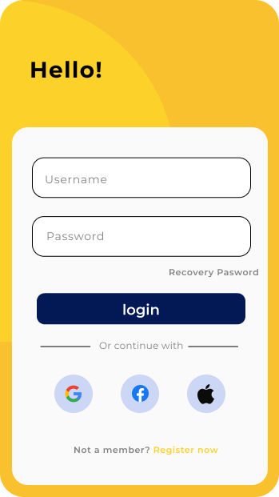

# Dream-routine

## 1.Hi Welcome 👋
***Dream-routine*** is my case study in **mobile proraming** subject in my university
This's a ***note app*** in Android.
You can write some note and it will remind you the task in this day!

**Some mock-up:**

       

--------------------------------------------------------------------------
**You can using my case study for reference.**
before that you need to something:
  - [Android studio](https://developer.android.com/studio?gclid=Cj0KCQjwvLOTBhCJARIsACVldV0jTnp5qI9AwLk5JWHFE0ltBTPuHkgkktx78DXhqdtPpaq3OiKya5EaAnQcEALw_wcB&gclsrc=aw.ds): as the environment to run the code
  - [Java](https://www.java.com/en/download/): This is main languges i using in this project

## 2. Employment ⚓
**Follow my steps:**
  1. Install or update Java
  2. Install Android Studio
  3. Clone my repository
  4. Unzip and run my code by Android Studio

--------------------------------------------------------------------------

## 3. Ending
Thank you a lot for interest in my project 💙.
Hope it can help in your programming learning ☕.

My contact 📧 : hoangson.hufflit@gmail.com 
And press star ⭐ if you like this repo 👌
